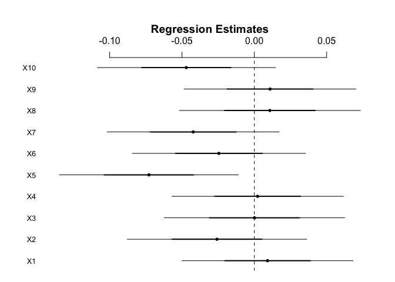
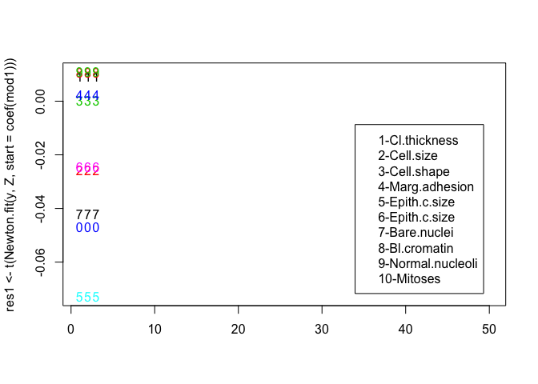
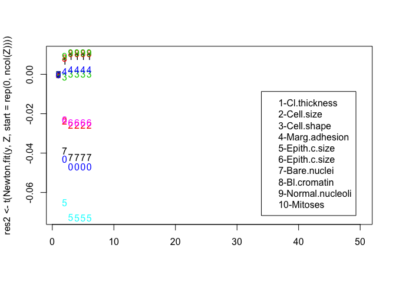

# Assignment 3: Newton–Raphson Method
Michael Enquist  
November 30, 2016  


```
## Loading required package: MASS
```

```
## Loading required package: Matrix
```

```
## Loading required package: lme4
```

```
## 
## arm (Version 1.9-1, built: 2016-8-21)
```

```
## Working directory is /Users/Enquist/github/Enquist_Mike/Enquist_Mike/AQM Assignments
```

## Summary
The Newton-Raphson method is a robust method for finding the roots of an equation. I would like to apply this method on the breast cancer dataset and cross validate it with the logistic regression. To prove that this method works, I need to plot the function in question to visualise how it behaves before attempting to locate the root(s).


```r
#subsetting the dataframe and transpose it into a matrix 
obs <- 683
Class <- df$Class
dat.adv <- df[-10]
dat.adv.1 <- cbind(1,dat.adv)
dat.adv.2 <- data.matrix(dat.adv.1,rownames.force = NA)
X<- dat.adv.2
y<- Class
Z <- t(matrix(X,ncol=obs))
```


Looking at the logistic regression and visualising the coefficients. Based on the regression estimates: Mitoses, Bl.cromatin, Bare.Nuclei, Cell.shape, and Cell.size have positive coefficients.


```r
mod1 <- glm(y~.-1,data.frame(y,Z),family="binomial")  
mod1
```

```
## 
## Call:  glm(formula = y ~ . - 1, family = "binomial", data = data.frame(y, 
##     Z))
## 
## Coefficients:
##         X1          X2          X3          X4          X5          X6  
##  0.0091456  -0.0258393   0.0001167   0.0022987  -0.0728868  -0.0244943  
##         X7          X8          X9         X10  
## -0.0422693   0.0107198   0.0108950  -0.0469899  
## 
## Degrees of Freedom: 683 Total (i.e. Null);  673 Residual
## Null Deviance:	    946.8 
## Residual Deviance: 888.5 	AIC: 908.5
```

```r
coefplot(mod1)
```

<!-- -->

Let f(x) be a differentiable function.There are four parameters in this function: y is the function you input, tol is the tolerance (default 1e −12), X is the initial guess, and N is the default number (100) of iterations. Verbose = true for logical purpose in order for R to report extra information on progress.


```r
tol=1e-8
Newton.fit <- function(y,X,start,N=50,tol=1E-14,verbose=T ){
  pred <- ncol(X)
  beta <- matrix(NA,ncol=N,
                 nrow=pred)
  beta[,1] <- start
  for (i in 2:N) {
    if (verbose) cat(i,"\n")
    p <- plogis(X %*% beta[,i-1])
    test <- diag(c(p*(1-p)))
    score <- t(X) %*% (y - p) # score function
    increm <- solve(t(X) %*% test %*% X) 
    beta[,i] <- beta[,i-1]+increm%*%score
    if (all(abs(beta[,i]-beta[,i-1]) < tol)) return(beta)
  }
  beta
} 
```
Now let's try to visualise the function by using plots. First, by looking at Newton.fit function to the mod1 coefficients and then the the dataset


```r
matplot(res1 <- t(Newton.fit(y,Z,start=coef(mod1))))
```

```
## 2 
## 3
```

```r
legend("bottomright", inset=.05, legend=c("1-Cl.thickness", "2-Cell.size","3-Cell.shape",
                                          "4-Marg.adhesion","5-Epith.c.size","6-Epith.c.size",
                                          "7-Bare.nuclei","8-Bl.cromatin","9-Normal.nucleoli",
                                          "10-Mitoses"), horiz=F)
```

<!-- -->

By running Newton.fit function in the logistic regression model. The Newton.fit is achieved by optimisation the parameter fitting of mod1. When looking at the plot, the numbers are represented by the coefficients. Mitoses, Bl.cromatin, Bare.nuclei, Cell.shape, and Cell.size are positive confidences, and the Newton.fit has learned two of each observations


```r
matplot(res2 <- t(Newton.fit(y,Z,start=rep(0,ncol(Z)))))
```

```
## 2 
## 3 
## 4 
## 5 
## 6
```

```r
legend("bottomright", inset=.05, legend=c("1-Cl.thickness", "2-Cell.size","3-Cell.shape",
                                          "4-Marg.adhesion","5-Epith.c.size","6-Epith.c.size",
                                          "7-Bare.nuclei","8-Bl.cromatin","9-Normal.nucleoli",
                                          "10-Mitoses"), horiz=F)
```

<!-- -->

The second plot represents the breast cancer dataset with the Newton.fit function. The function has learned six of each steps 


```r
all.equal(res2[1,],unname(coef(mod1))) 
```

```
## [1] "Mean absolute difference: 0.02456555"
```

```r
all.equal(res2[2,],unname(coef(mod1))) 
```

```
## [1] "Mean relative difference: 0.1229314"
```

```r
all.equal(res2[3,],unname(coef(mod1))) 
```

```
## [1] "Mean relative difference: 0.001806823"
```

```r
all.equal(res2[4,],unname(coef(mod1))) 
```

```
## [1] "Mean relative difference: 4.207776e-07"
```

```r
all.equal(res2[5,],unname(coef(mod1))) ## TRUE
```

```
## [1] TRUE
```

```r
all.equal(res2[6,],unname(coef(mod1))) ## TRUE
```

```
## [1] TRUE
```

Now to prove this test, I used all.equal function to test if two objects are (nearly) equal. The six steps that were learned from the Newton.fit had a mean absolute difference between 1 to 4 steps, and were equal between 5 and 6 steps


Write maximum 400 words on gradient descent (GD) answering the following (LaTeX preferred):

Optimisation is essential to prove that our models are efficient. Optimisation is the core of machine learning. Gradient descent is an optimisation method used in machine learning. It is a procedure that is used in many machine learning algorithms. The learning rate is the value that determines the size of the steps we take to reach the predicted value. Selecting a proper learning rate can be difficult. A small learning rate leads a slow convergence, and a large learning rate can hinder convergence and fluctuate the function. 

The reason we normalise data is to make sure that we have the same range of values for each of the inputs in our model. This will lead to stable convergence of weight and biases. Also, normalisation is normalising residuals by transforming data.

When the gradient descent method converges, it means that our model give us a better idea which learning rate value is just right, and determining the steepest descent is governed by the condition number of the matrix. Also, it is important to compare the convergence to the exact result and make sure we get what the condition number was telling us.
 


